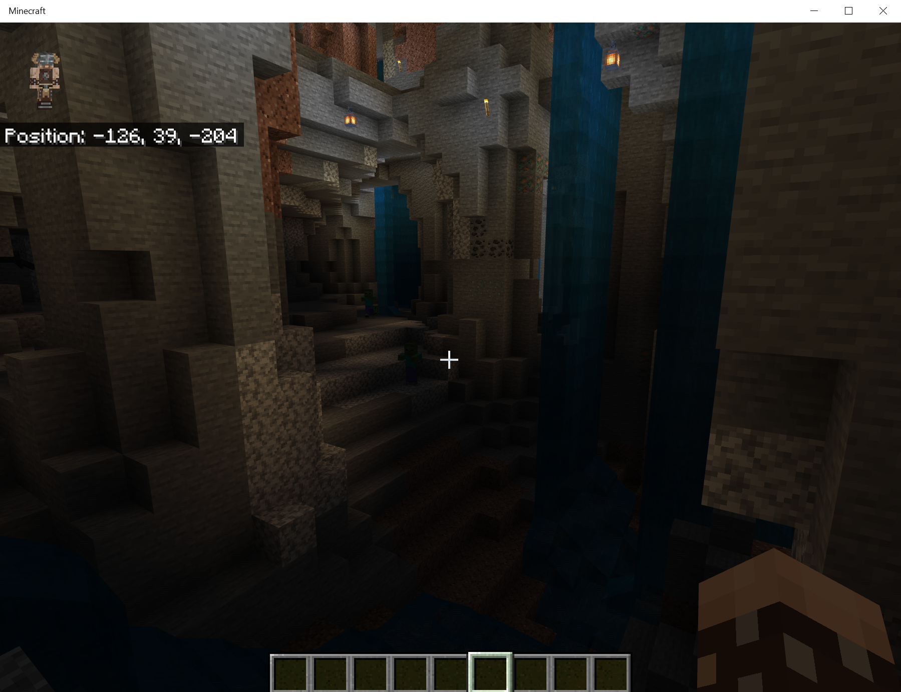
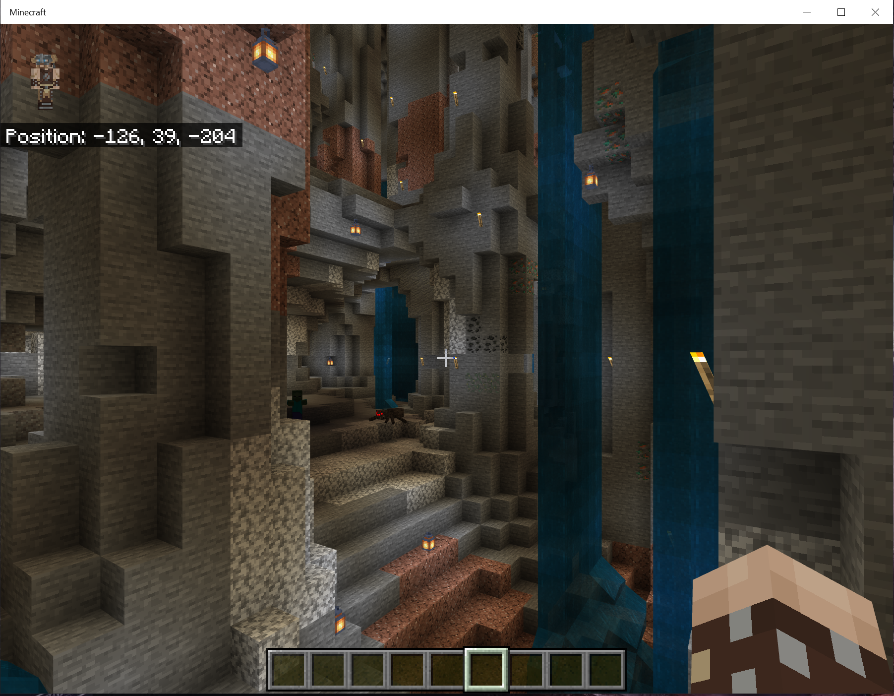
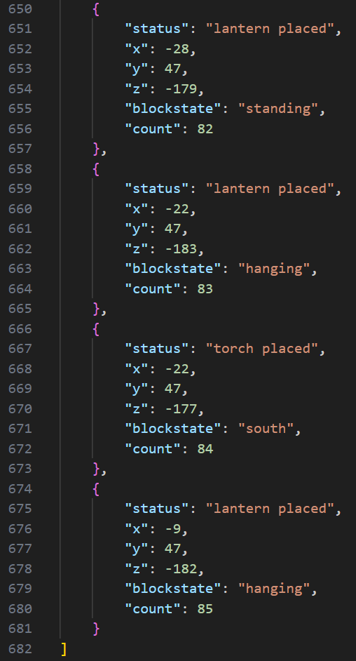

# Amulet-Plugins
Plug-ins for the Amulet Minecraft Editor

Operation Plug-ins must be placed in -- %User Home%\AppData\Local\AmuletTeam\AmuletMapEditor\plugins\operations
This directory is created after you run Amulet for the first time (if you run from source) or with the installation if you use the dotEXE.
Example... "C:\Users\Inquisition\AppData\Local\AmuletTeam\AmuletMapEditor\plugins\operations"

## Indoor Lighing Placement Plug-in -- v1
This operation is meant to help one light one's favorite indoor spaces evenly.  I've tested selections up to 128 x 128 in X and Z.  Y selection should be a single block tall.

I have built a programmatic set of tests into the script to first look for edges between air blocks and non-air blocks in your environment.  It will then start populating empty blocks with your selection of torches, lanterns, or both.

The detection radius input cretes an array at run time around each block that is an edge.  It will then check for other lava, torches, and lanterns within the radius specified.  This allows control of the lighting density.

Lanterns will place as hanging if there is a solid block above them, and standing if there is a solid block below them.  Torches will be placed in a cardinal direction corresponding to the "air/block interface" that is found in the array of edge blocks.  The script is checking block placement for lava, water, and gravel, so you shouldn't get any torches or lanterns attached in Amulet to lava, water, or gravel.

Lastly, the script places logs called "selection_to_array.json" and "torch_log.json" in the working directory of your Python installation for Amulet.  The "selection_to_array" is the coordinates of the edges the script detected.  The "torch_log" is the coordinates, lighting type, and misc. info for each light that is placed.

### Before Lighting

### After Lighting at 3 Y levels

### Example selection -- ~20K Blocks

This selection size is processed inside of Amulet in ~2 seconds on my PC.

### Example log output from selection above

